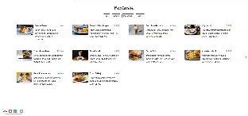

QR MENU Restorant Web Page - 

this is a user-friendly restaurant web page designed with a responsive layout for optimal viewing across different devices. When menu items are clicked, relevant data is displayed in detail on a separate page. This project utilizes technologies such as CSS, HTML, JavaScript, and Bootstrap.

Features
Responsive Design: The web page is crafted to provide an excellent viewing experience on various devices.

Data Retrieval: The page fetches restaurant-related data using an API, ensuring that the information presented is current and accurate.

Interactive Descriptions: Users can explore detailed information by clicking on specific data elements. This interactive feature allows seamless exploration of additional content.

